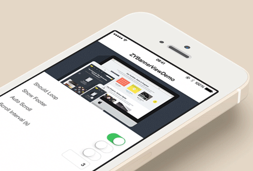

[](http://cocoapods.org/?q=ZYBannerView)&nbsp;
[](http://cocoapods.org/?q=ZYBannerView)&nbsp;
[](https://www.apple.com/nl/ios/)&nbsp;

# ZYBannerView
- 简单易用的轮播控件, 基于UICollectionView实现.



## Features

- [x] 显示的内容可高度自定义
- [x] 可配置循环滚动效果
- [x] 可配置是否自动滚动, 以及自动滚动时间间隔
- [x] 显示\隐藏Footer
- [x] 自定义PageControl属性
- [x] 支持在Storyboard\xib中创建并配置其属性
- [x] 支持Autolayout

## Usage

### Basic Usage

> 只需简单的2步即可快速集成此控件

#### 1.创建Banner并设置数据源

```Objective-C
self.banner = [[ZYBannerView alloc] initWithFrame:CGRectMake(0, 0, 200, 100)];
self.banner.dataSource = self;
[self.view addSubview:self.banner];
```

#### 2.实现数据源方法

```Objective-C
// 返回Banner需要显示Item(View)的个数
- (NSInteger)numberOfItemsInBanner:(ZYBannerView *)banner
{
    return 3;
}

// 返回Banner在不同的index所要显示的View
- (UIView *)banner:(ZYBannerView *)banner viewForItemAtIndex:(NSInteger)index
{
    UIImageView *imageView = [[UIImageView alloc] initWithImage:[UIImage imageNamed:@"xxx"]];
    return imageView;
}
```

### Advanced Usage

> 各种属性与方法的介绍

#### Property

- 是否需要循环滚动, 默认为`NO`
```Objective-C
@property (nonatomic, assign) IBInspectable BOOL shouldLoop;
```

- 是否显示Footer, 默认为`NO` (此属性为`YES`时, `shouldLoop`属性会被置为`NO`)
```Objective-C
@property (nonatomic, assign) IBInspectable BOOL showFooter;
```

- 是否自动滑动, 默认为`NO`
```Objective-C
@property (nonatomic, assign) IBInspectable BOOL autoScroll;
```

- 自动滑动间隔时间(s), 默认为 3.0
```Objective-C
@property (nonatomic, assign) IBInspectable NSTimeInterval scrollInterval;
```

- Banner上显示的PageControl, 可自由配置其属性, 例如`pageIndicatorTintColor`, `currentPageIndicatorTintColor`
```Objective-C
@property (nonatomic, strong, readonly) UIPageControl *pageControl;
```

- 根据需要设置PageControl的frame, 若不设置或者设置为CGRectZero, 则使用默认位置
```Objective-C
@property (nonatomic, assign, readwrite)  CGRect pageControlFrame;
```

- 数据源与代理
```Objective-C
@property (nonatomic, weak) IBOutlet id<ZYBannerViewDataSource> dataSource;
@property (nonatomic, weak) IBOutlet id<ZYBannerViewDelegate> delegate;
```

> NOTE : `shouldLoop`, `showFooter`, `autoScroll`, `scrollInterval`, `dataSource`, `delegate` 均可支持在Storyboard\xib中直接设置

#### Method

- 刷新Banner的数据
```Objective-C
- (void)reloadData;
```

- 开始/停止用于自动滚动的定时器. 比如可以在`viewWillAppear:`和`viewWillDisappear:`中分别调用这两个方法, 使得Banner没有显示的时候定时器不会一直占用着资源.
```Objective-C
- (void)startTimer;
- (void)stopTimer;
```

#### DataSource

- 返回Banner需要显示Item(View)的个数 【required】
```Objective-C
- (NSInteger)numberOfItemsInBanner:(ZYBannerView *)banner;
```

- 返回Banner在不同的`index`所要显示的View. 这个View可以是简单的一个UIImageView, 也可以是自定义的一个复杂的View. View的大小自动布局为Banner的大小, 无需对此View设置`frame` 【required】
```Objective-C
- (UIView *)banner:(ZYBannerView *)banner viewForItemAtIndex:(NSInteger)index;
```

- 返回Footer在不同状态下(`ZYBannerFooterStateIdle`正常状态 \ `ZYBannerFooterStateTrigger`触发状态)显示的文字【optional】
```Objective-C
- (NSString *)banner:(ZYBannerView *)banner titleForFooterWithState:(ZYBannerFooterState)footerState;
```

#### Delegate

- 当用户点击了第`index`个Item时, 此代理方法将被调用 【optional】
```Objective-C
- (void)banner:(ZYBannerView *)banner didSelectItemAtIndex:(NSInteger)index;
```

- 当用户拖动Footer并达到触发点时, 此代理方法将被调用【optional】
```Objective-C
- (void)bannerFooterDidTrigger:(ZYBannerView *)banner;
```

## Requirements

- iOS 7.0+
- Xcode 5.0+

## Installation

1.使用CocoaPods:
```Objective-C
pod 'ZYBannerView'
```

2.手动添加:
- 将ZYBannerView文件夹中拖拽到项目中
- 导入头文件：`#import "ZYBannerView.h"`

## License

ZYBannerView is released under the MIT license. See LICENSE for details.

## ZYBannerView in C#

Looking to incorporate ZYBannerView into your project in Xamarin? Check out [ZYBannerView_Xamarin](https://github.com/jingliancui/ZYBannerView_Xamarin) (thanks to [jingliancui](https://github.com/jingliancui)).
